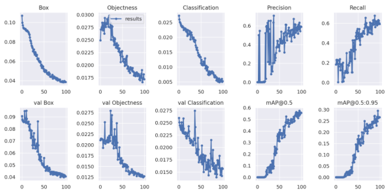

# 🔖 Open Source design baSic _ Project
## ⛑️ Detects wearing a helmet

|Team 11|Weeks|Distributing roles|
|-|-|-|
|-|Week1|개발환경을 세팅, `Dataset` 준비 및 라벨링 작업|
|-|WeeK2|라벨링된 이미지를 `Yolov5s`를 이용해 학습시킴|
|-|WeeK3|설정값을 변경하며 원하는 결과가 나올 때까지 테스트를 진행|

## Needs

- >pyTorch 기반 Yolov5
- >Cuda, Cudnn 신경망

* * *
## Summary :
```
운전자의 안전모 착용 유무를 확인하여 미착용시 경고음을 출력한다.

Yolov5 프레임워크 오픈소스를 사용하여 안전모 착용모습을 학습시킴.
인식에 실패할 경우 경고음을 내보낸다

머리를 보호 할 수 있는 안전 장비라면(모자나 방한용품은 제외) 모두 인식이 될 수 
있도록 신뢰도가 높은 dataset을 준비해야한다.

Detection이 성공적으로 이뤄진다면 중상이나 사망사고를 줄일 수 있는 방안이 될 것이다.
또한, 이용자들의 안전 장비 착용에 대한 인식 개선에도 기여할 것으로 기대가 된다
```

## Thanks for


- Yolov5 Framework : [Yolov5](https://github.com/ultralytics/yolov5.git, "Yolov5 link")

- LabelImg : [labelImg](https://github.com/tzutalin/labelImg.git, "labelImg link")

- Roboflow : [labelImg](https://roboflow.com/, "Roboflow link")

## Graph



# How to Use?

### Labeling

- https://github.com/tzutalin/labelImg.git

```

$ git clonehttps://github.com/tzutalin/labelImg.git
$ cd labelImg
$ python labelimg

# class와 names에 맞게 labeling 진행

$ git clone https://github.com/ultralytics/yolov5  # clone repo
$ cd yolov5
$ git reset --hard 886f1c03d839575afecb059accf74296fad395b6

# clone YOLOv5 repository

$ cd /content/yolov5
$ cat ../data.yaml

    train: ../train/images
    val: ../valid/images

    nc: 2
    names: ['With Helmet', 'Without Helmet']

# yaml파일 생성 후 확인

$ python train.py --img 416 --batch 16 --epochs 100 --data '../data.yaml' --cfg ./models/custom_yolov5s.yaml --weights '' --name yolov5s_results  --cache

                    from n    params  module                                  arguments                     
    0                -1  1      3520  models.common.Focus                     [3, 32, 3]                    
    1                -1  1     18560  models.common.Conv                      [32, 64, 3, 2]                
    2                -1  1     19904  models.common.BottleneckCSP             [64, 64, 1]                   
    3                -1  1     73984  models.common.Conv                      [64, 128, 3, 2]               
    4                -1  1    161152  models.common.BottleneckCSP             [128, 128, 3]                 
    5                -1  1    295424  models.common.Conv                      [128, 256, 3, 2]              
    6                -1  1    641792  models.common.BottleneckCSP             [256, 256, 3]                 
    7                -1  1   1180672  models.common.Conv                      [256, 512, 3, 2]              
    8                -1  1    656896  models.common.SPP                       [512, 512, [5, 9, 13]]        
    9                -1  1   1248768  models.common.BottleneckCSP             [512, 512, 1, False]          
    10                -1  1    131584  models.common.Conv                      [512, 256, 1, 1]              
    11                -1  1         0  torch.nn.modules.upsampling.Upsample    [None, 2, 'nearest']          
    12           [-1, 6]  1         0  models.common.Concat                    [1]                           
    13                -1  1    378624  models.common.BottleneckCSP             [512, 256, 1, False]          
    14                -1  1     33024  models.common.Conv                      [256, 128, 1, 1]

# training

$ python detect.py --weights runs/train/yolov5s_results/weights/best.pt --img 416 --conf 0.3 --source ../test/images

    /content/yolov5
    Namespace(agnostic_nms=False, augment=False, classes=None, conf_thres=0.3, device='', exist_ok=False, img_size=416, iou_thres=0.45, name='exp', project='runs/detect', save_conf=False, save_txt=False, source='../test/images', update=False, view_img=False, weights=['runs/train/yolov5s_results/weights/best.pt'])

# test image Detection
```